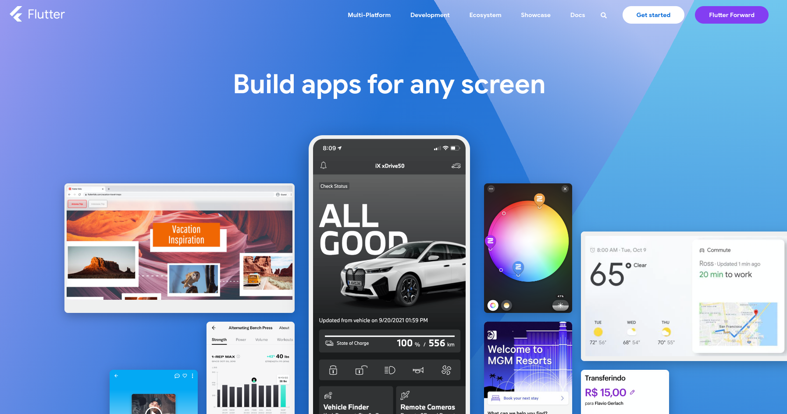

# Flutter




Flutter is Google's mobile UI framework for crafting high-quality native interfaces on iOS, Android, Web, Windows, Linux and Mac. 

## Official website

[https://flutter.dev/](https://flutter.dev/)

## Installation

Flutter is available on the following operating systems:

* Windows
* Linux
* Mac

[Flutter Installation](https://flutter.dev/docs/get-started/install)

## Supported target platforms

* Android
* iOS
* Web
* Windows
* Linux
* Mac

## Versions

* [Flutter Releases Page](https://flutter.dev/docs/development/tools/sdk/releases)

## Getting Started

[Flutter Getting Started](https://flutter.dev/docs/get-started/codelab)

## Packages

[Flutter Packages](https://pub.dev/)

## Plugins

[Flutter Plugins](https://pub.dev/flutter/plugins)

## Examples

[Flutter Examples](https://flutter.dev/docs/cookbook)

[it's all widgets](https://itsallwidgets.com/)

## Tutorials

[Flutter Tutorials](https://flutter.dev/docs/reference/tutorials)

## Dart pad

Dart pad is a web-based tool that allows you to write Dart code and execute it in the browser.

[dartpad.dev](https://dartpad.dev/)

## Dart

Dart is the programming language for Flutter. It is a client-optimized language for fast apps on any platform.

To learn dart go on [dart.dev](https://dart.dev/)

## Code example

```dart
import 'package:flutter/material.dart';

void main() => runApp(MyApp());

class MyApp extends StatelessWidget {
  @override
  Widget build(BuildContext context) {
    return MaterialApp(
      title: 'Flutter Demo',
      theme: ThemeData(
        primarySwatch: Colors.blue,
      ),
      home: MyHomePage(title: 'Flutter Demo Home Page'),
    );
  }
}

class MyHomePage extends StatefulWidget {
  MyHomePage({Key key, this.title}) : super(key: key);

  final String title;

  @override
  _MyHomePageState createState() => _MyHomePageState();
}

class _MyHomePageState extends State<MyHomePage> {
  int _counter = 0;

  void _incrementCounter() {
    setState(() {
      _counter++;
    });
  }

  @override
  Widget build(BuildContext context) {
    return Scaffold(
      appBar: AppBar(
        title: Text(widget.title),
      ),
      body: Center(
        child: Column(
          mainAxisAlignment: MainAxisAlignment.center,
          children: <Widget>[
            Text(
              'You have pushed the button this many times:',
            ),
            Text(
              '$_counter',
              style: Theme.of(context).textTheme.headline4,
            ),
          ],
        ),
      ),
      floatingActionButton: FloatingActionButton(
        onPressed: _incrementCounter,
        tooltip: 'Increment',
        child: Icon(Icons.add),
      ),
    );
  }
}
```

