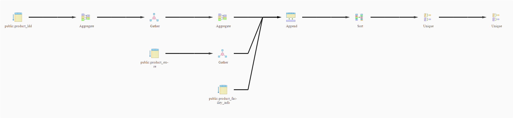
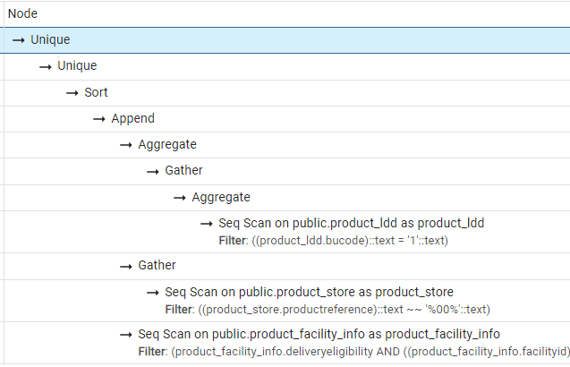
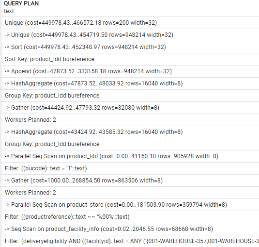

# PostgreSQL

PostgreSQL is an Open Source [RDBMS](https://en.wikipedia.org/wiki/Relational_database).

## Brief History
 * Firsts development in 1986
 * First open source release in 1997 (version 6.0) 
 * Supports SQL92 in 2000 (version 7.0) 
 * All RDBMS specifications are implemented in 2005 (version 8.0) 
 * Data-Warehouse support in 2008 (version 8.3) 
 * Lots of optimizations and reviews from 2010 to 2016 (version 9.x)
 * Improve performance, JSON support, robustness (version 10 to 14)
 * Implements MERGE in 2022 (version 15)


## Technical organization

### Server configuration
The config files are in */data* folder

  * **postgresql.conf**: contains server configuration
  * **pg_ident.conf**: is the configuration between system user and database user
  * **pg_hba.conf**: is the client network management file

### File System organization
PostgreSQL have 
 * **TABLESPACE** to manage table localization on disk.
 * **SCHEMA** to split easily the tables between users
 
## SQL Queries
 [See SQL page](../sql/sql.md)

## Stored procedures
 *coming soon*
 
## Performances

### Indexes
When you design your database, each primary key and foreign key have an automatic index. But in som cases, you nedd to add another ones for performance.

    By example, we need to query with a WHERE clause on two columns (begin_date and end_date) but this query is slow.

```sql
CREATE INDEX idx_people 
    ON people(begin_date, end_date) 
    USING BTREE;
```

PostgreSQL provides many types of index algorithm, BTREE is the most common but you can please read the [official documentation](https://www.postgresql.org/docs/current/indexes-types.html) for further information.

    
### Execution plan
The  __execution plan__  also called  __explain plan__  is the analysis of your query by the RDBMS engine. This analysis permits you to optimize your query or indexes on your table to reduce the codst of duration or memory.
 
```sql
EXPLAIN
  select distinct t.bureference from (
    SELECT distinct bureference FROM public.product_ldd where bucode='1'
     UNION
    select productreference from public.product_store where  productreference like '%00%' 
     UNION
    SELECT  productreference as bureference FROM public.product_facility_info 
      where deliveryeligibility=true 
           and facilityid in ('001-WAREHOUSE-357','001-WAREHOUSE-359','001-WAREHOUSE-433','001-WAREHOUSE-446','001-WAREHOUSE-447','001-WAREHOUSE-460','001-WAREHOUSE-472','001-WAREHOUSE-483','001-WAREHOUSE-462')
  ) t 
  order by t.bureference
```

Graphical results



Analysisresults



Text results



### Partitioning
PostgreSQL can natively make some partitions of your data. This case should only be used when a very massive table is present to scale the performance.

    By example, we will imagine a table of all living people on earth and we a a performance trouble 
    when we query on these data by group of economic region. Basically it is easy to imagine 
    that a short table for Europe, North America, Region of China can reduce the data processed 
    where you query one region.

```sql
CREATE TABLE people (
    id         long not null,
    name       string not null,
    country    string not null
    ...
) PARTITION BY LIST (country);
  
CREATE TABLE people_eu 
    PARTITION OF people
    FOR VALUES IN ('FR', 'ES', 'IT', 'DE', 'NL' , ...., 'PL');
```

For further information, please read the [official documentation](https://www.postgresql.org/docs/current/ddl-partitioning.html)

## Bulk load/dump
### loading from CSV file

This method is the better way to load huge amount of data from a flat file.

```sql
COPY YOUR_TABLE FROM '/thePath/theCsvFileWithoutHeader.csv' WITH (FORMAT csv);
```

### dump to CSV file

This method is the better way to dump huge data volume into a flat file.

```sql
copy (
  select distinct t.productreference, t.contextcode, w.transport_type, typ from (
    select productreference, storeid as contextcode, 'STORE' as typ 
      FROM public.product_store 
    UNION
    SELECT  productreference, facilityid as contextcode, 'WAREHOUSE' as typ 
      FROM public.product_warehouse
      WHERE deliveryeligibility=true
  ) as t left join wtt w on t.productreference=w.product_reference
  order by t.productreference, t.contextcode
) to '/thePath/gtin_regional' csv;
```

## Administration tasks

The administration commands are run directly in a console on the database server.


### Optimization

In PostgreSQL, the  __vacuum__  process is the cleaning the old parts of indexes where the data have been modified, deleted, the  __reindex__  is the process that rebuild clean indexes

```sh
  vacuumdb  -U postgres YOUR_DB
  reindexdb  -U postgres YOUR_DB
```
  
### Backup

```sh
 pg_dump -U postgres -b -Fc -o -v -f YOUR_DB.dump YOUR_DB
```

### Restore

```sh
 pg_restore -U postgres -v -Fc -O -d YOUR_DB YOUR_DB.dump
```
