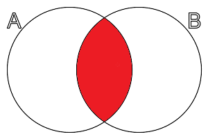
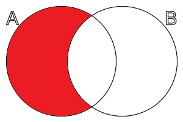
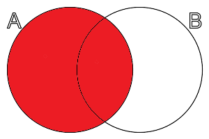
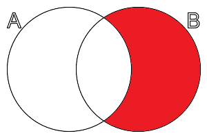
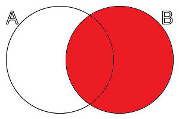
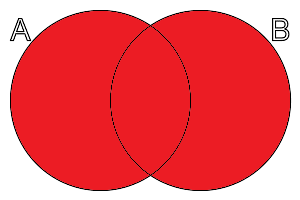
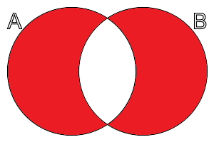

# Structured Query Language
 *writing in progress*
 
## Brief history

## Transaction
Transaction is a statement to control process and data manipulation and permit to validate or invalidate the data processing.
The acceptance of the transaction is a  __commit__  and the reject of the transation is a  __rollback__ .
The best practice is to not use  __autocommit__ .


## SELECT

```sql
  SELECT T.column0, T.column1, ..., T.columnN FROM tableName T
```

## CONDITION


```sql
  SELECT T.column0, T.column1, ..., T.columnN FROM tableName T
    WHERE T.column0 like '%data%'
```

## INSERT

```sql
  INSERT INTO tableName(column0, T.column1, ..., T.columnN)
    VALUES ('data0', 'data1', ..., 'dataN')
```

## UPDATE
```sql
  UPDATE tableName
    SET column1='data1', ..., columnN='dataN'
    WHERE column0='data0'
```

## DELETE
```sql
  DELETE FROM tableName
    WHERE column0='data0'
```

## MERGE

## JOINS
### INNER JOIN
```sql
  SELECT A.*, B.* FROM tableA A
    INNER JOIN  tableB B ON A.key=B.key
```



### LEFT JOIN
```sql
  SELECT A.*, B.* FROM tableA A
    LEFT JOIN  tableB B ON A.key=B.key
```



### LEFT OUTER JOIN
```sql
  SELECT A.*, B.* FROM tableA A
    LEFT OUTER JOIN  tableB B ON A.key=B.key
```




### RIGHT JOIN
```sql
  SELECT A.*, B.* FROM tableA A
    RIGHT JOIN  tableB B ON A.key=B.key
```



### RIGHT OUTER JOIN
```sql
  SELECT A.*, B.* FROM tableA A
    RIGHT OUTER JOIN  tableB B ON A.key=B.key
```




### FULL OUTER JOIN
```sql
  SELECT A.*, B.* FROM tableA A
    FULL OUTER JOIN  tableB B ON A.key=B.key
```





```sql
  SELECT A.*, B.* FROM tableA A
    FULL OUTER JOIN  tableB B ON A.key=B.key
    WHERE A.key IS NULL OR B.key IS NULL 
```




## GROUPING
The use some aggregate function like: avg, count, min, max, ...  you have to use grouping

```sql
    GROUP BY
```
    
## CONDITION IN GROUP
To add a condition on grouped data

```sql
    HAVING
```

## RANKING

```sql
    RANK OVER ... PARTITION BY
```
    
    
    
## TRUNCATE
The truncate command erase all the content of a table and it shoudn't be rollbacked.

```sql
  TRUNCATE TABLE tableName
```


## Functions
[PostgreSQL official documentation for functions](https://www.postgresql.org/docs/current/functions.html)


## External links
[French SQL Course](https://sql.sh/cours)
